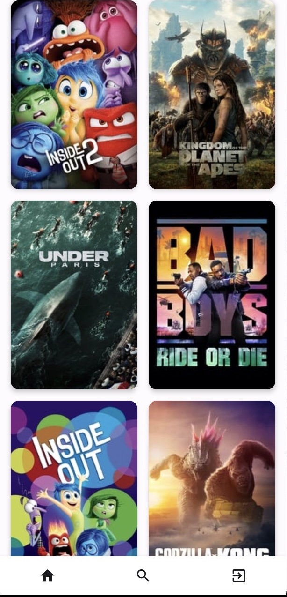

# CinematiX: Instructions

## Initial Setup

### Configure Gradle
Add necessary dependencies for Jetpack Compose, Retrofit, Coroutines, Firebase, and UnitTesting in the `build.gradle` files.

## App Architecture

### MVI Clean Architecture
Implement the app using MVI (Model-View-Intent) Clean architecture to ensure a scalable and maintainable codebase.

### Create a Model
Define data classes for the information via Postman.

### Create a Repository
Implement a repository class that will use Retrofit to fetch data from the API.

### Create a ViewModel
Implement a ViewModel that will use the repository to load data and expose it to the UI.

## User Interface

### Create Composable Functions
Create UI screens with Jetpack Compose.

### Implement Navigation
Use Jetpack Navigation to navigate between different screens.

## Firebase Authentication

### Set Up Firebase Authentication
Configure Firebase for login and sign-up functionality.

### Implement Login and Sign-Up
Create composable functions for login and sign-up screens and integrate them with Firebase authentication.

## Fetch Data
Use the location coordinates to fetch data from the API.

## Testing

### Write Unit Tests
Use JUnit and Mockito to write unit tests.

